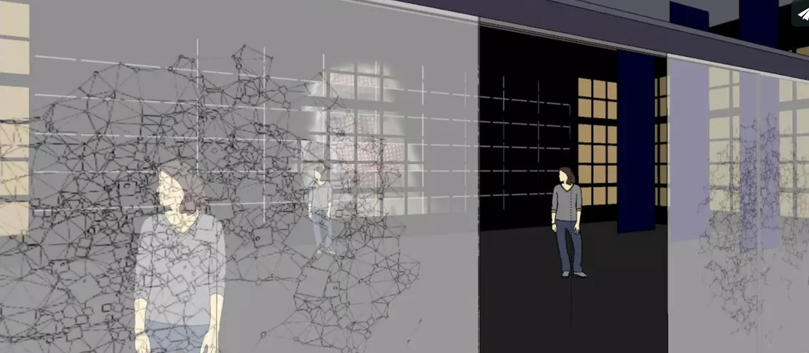

# Sydney's Blog Post 
------

### Art Piece 1

	The art piece Footfalls created by Golan Levin and Zachary Lieberman is an interactive installation that utilizes both auditory and visual sensing techniques to project images of balls on to a white screen. The balls move according to the movement of bystanders reacting to sound detected by microphones hidden in the floor. I was initially drawn to this piece because of the artists’ choice to create an installation that interacts with individuals on a personal level. Because individuals themselves dictate the images projected on the screen, the art becomes personalized to the body and movements of the individuals rather than the artists. Further, the experience linking individuals to the art through their bodies is one that is powerful. The installation makes me wonder- does art move/inspire people or do people move/inspire art? I think this installation helps prove the answer is both. 

[Here's a link to the piece](http://www.flong.com/projects/footfalls/)

### Art Piece 2

	The interactive art installation called Pixi is a digital organism that replicates patterns found in nature. The Pixi installation challenges my very notions of the relationship between nature and technology. I have always juxtaposed the two—thinking that technology was the antithesis of nature. Yet, the Pixi art piece pushes me to think differently, allowing me to imagine a world in which technology is inspired by nature and ultimately compliments nature rather than distracts from it. Pixi’s ability to react and think for itself amazes me. I am interested to learn more about the type of coding that is needed to program such a device so that it can continue functioning on its own. 

[Here's a link to the piece](http://www.creativeapplications.net/environment/pixi-nature-aware-self-sufficient-digital-organism-breathes-in-the-forest/)

### Check-in Blog Post
The process of creating my first project was hard and at times frustrating but ultimately, it was very rewarding. I have never coded before and was very intimidated by the prospect of working with technological languages I did not know how to write. However, as the semester has unfolded, I have become increasingly more comfortable leaning into discomfort and embracing my beginner level skillset. I am determined to work hard and create art through this new medium. I appreciate how the class is structured allowing us students to both learn new technical skills and explore using the software, however, I think I am at such a beginning level that I need more guidance when it comes to learning the technical skills. My plan of attack moving forward is to spend more time reading the Make Getting Started with p5.js and coming to office hours on Tuesdays to ask any questions I amy have concerning the software and week's assignment.

### Chance Art Piece 1

Hanibal Srouji is the artist of this piece, Black Boogie Woogie. Srouji is from Lebanon and is based in Beirut currently. I was drawn to this piece integrating chance because it utilizes both technology and canvas to create a piece that evokes emotion and a sense of inner peace. This piece incorporates chance through its multicolored neon light and the contrast created between the hot, red and the colder,blue is beautiful and stark. Usually, I am drawn to art pieces that make me reflect on the relationship between technology and nature and I think art is a powerful mechanism to explore that relationship. 

[Here's a link to the piece](https://www.artsy.net/artwork/hanibal-srouji-black-boogie-woogie-i)

### Chance Art Piece 2

The artist, Martin Reyna, created this piece titled, Le Bois. Reyna is from Argentina but is based in Paris. I was drawn to this piece because the colors and free movement of the shapes are simple yet dramatic in their course of action. I think her use of chance is reflected in the random shape of the colors on the canvas. While this painting does not utilize technology or algorithms (to my knowledge),I think the concept of chance reflected in the art piece can be applied to a code in which shapes take on courses of their own through a programming code that gives the shapes/colors a life of their own. 

[Here's a link to the piece](https://www.artsy.net/artwork/martin-reyna-le-bois)

### Artistic evolution blog post

For me, creating art for this Interactive Graphics class has been a process in which often times I am forced to compromise my initial (complex) artistic vision for more simplistic visions that are appropriate for my current skillset and level of coding. While initially I was disappointed that I was constantly finding myself trying to compromise my designs and ideas, I have come to realize that like any new skill or language, as we discussed in class, learning is a process and one that does not happen over night. I am finding great joy in my progress and participating in class critiques that allow myself to engage in meaningful and thoughtful discussion both about code and art. 

As for how my designs evolve, I would say that the evolution itself is one of the most exciting aspects of the creation of projects in this class. Because the art pieces I have produced have been reflective of personal experiences, I find it much more powerful and important to stick to an experience as a guiding theme for my art rather than trying to control every aspect of the aesthetics of the end piece. The first art piece I created (inspired by the Camino) did change somewhat from my initial project. While my first version of the project incorporated a video I had filmed on the Camino, my final piece did not. The process of changing the piece was important because it helped me develop and use new coding skills that I had learned so I was not disappointed with the evolution of the design but rather proud that my initial idea was able to lead to a second interesting idea. 

### Data Visualization blog post 1

We Feel Fine is an art piece that utilizes data visualization to display human feelings found from phrases in blogs posted on the internet. The artist, Jonathan Harris, describes the art piece as an exploration of human emotion on a global scale. After searching the internet for newly posted blogs containing the phrases, I feel and I am feeling, the phrases are organized into a particle system. The color, size, shape and opacity of the particles are all indicative of the type of feeling inside the particle. The art piece is also interactive. Users can search questions like what do people feel right now in London? What are the saddest cities in the world? etc. 

What I found most moving about this piece was the artist's underlying motivation for creating it. He describes the work as one that is authored by everyone and one that he hopes makes the world seem a little smaller. I am deeply moved by this because the internet and especially social media can foster sensations of loneliness and inadequacy, at times making people feel far removed from reality and eachother. This art piece tries to bring people together through finding common threads of emotion and I believe it does so in a thought provoking way. 

[Here's a link to the piece](http://number27.org/wefeelfine)

### Data Visualization blog post 2 

The art piece, Fleshmap, uses data visualization to express human desire through collective shapes and individual expressions. The artists, Fernanda Viegas and Martin Wattenberg, wanted to showcase the connection between the body and its visual and verbal representations. Through using the following categories of touch, look and listen, the artists investigated collective perceptions and patterns in order to display their data through an artistic visualization. The touch component of their data visualization is focused on highlighting erogenous zones, the look component of their data visualization is focused on exposing overlooked patterns found on the human body and their listen component of their data visualization points to analyzing which parts of teh anatomy appear teh most in song lyrics. 

I was drawn to this piece because of it's intimate nature. Often times I associate concepts such as technology and data visualization as being far removed from the human body and even more so removed from the intimate experiences of the human body. The piece Fleshmap challenges my previous notions by helping me see a connection between technology and the human body. The data visualization component allowed for the connection to be presented in such a way that is moving and truly beautiful. 

[Here's a link to the piece](http://www.bewitched.com/fleshmap.html)

## Connecting things blog post 1

The art piece Wind and Wave is a Physical Media Installation that uses both fan and light to create a breathtaking installation. The art piece is made from a white cloth fabric that is tied to the walls of a small interior room. The art piece appears blue because of variously hidden light fixtures in the room and moves because of hidden fans in the room. While the website displaying the physical computing art does not explain how technology is specifically utilized in this piece, I am nonetheless inspired by the piece and its ability to transform technology and seemingly ordinary objects into art. My favorite aspect of the art installation is its calming nature, replicating both wind and waves. 

[Here's a link to the piece](http://themo-on.com/2015/10/23/wind-and-wave-nepa-concept-show/?ckattempt=1)

## Connecting things blog post 2

The art piece radical is an interactive dance performance that explores self-organizing systems. Music is generated from dancers' muscles and blood flow through biophysical sensors that capture sound waves from dancers' bodies. The data collected creates beautiful and complex neural patterns that are displayed on screens as 3D images. The piece engages its audience by allowing the audience to interact with the images produced and enter into a dialogue with the dancers. The piece is somewhat revolutionary as it is one of the first large-scale art pieces to use biotechnology and network bodies with interactive dance. The piece also utilizes music produced by artists from around the world as well as dancers who participate in real time by following movements from a shared movement database of choreography. The dancers wear two sensors that measure their blood flow and muscle movement.

This piece is incredibly complex. I am blown away by the intricate design and execution of all the components of the piece. I love how this piece brings together many different teams with varying skillsets to work together and produce something daring and bold. To me, this art piece represents the art of the future. I am excited to continue to explore more physical computing pieces to compare them to the two pieces I have already written about in this blog. 

[Here's a link to the piece](http://generactive.net/radical-signs-of-life/)